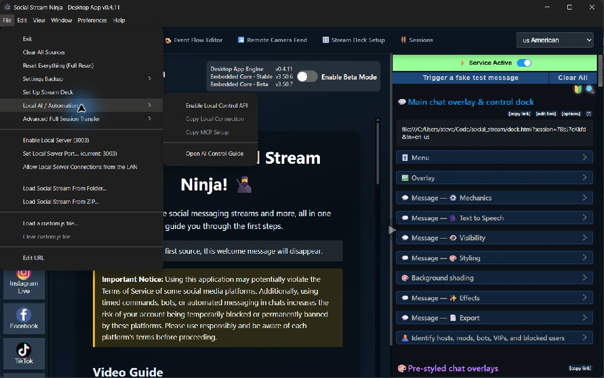

# Social Stream Ninja Desktop App (SSApp)

[](https://www.gnu.org/licenses/gpl-3.0)
[](https://github.com/steveseguin/ssn_app/actions)

SSApp is the desktop runtime for [Social Stream Ninja](https://socialstream.ninja). It packages the Social Stream interface inside Electron and adds the operating-system features that a normal browser tab cannot provide: persistent source windows, isolated sign-in sessions, hidden capture, local media, local servers, Stream Deck support, headless operation, backups, and local AI automation.

This repository contains the desktop application. The Social Stream web interface, overlays, and platform capture scripts live in the separate [social_stream repository](https://github.com/steveseguin/social_stream).


## What the desktop app adds

- **Persistent capture windows** for each chat source, including pages that require a real browser session.
- **Standard and direct-connection modes** for supported platforms, with source-specific sign-in and fallback handling.
- **Hidden and headless capture** so source windows do not need to remain on screen.
- **Separate browser sessions** for multiple accounts on the same platform.
- **Local Text-to-Speech and speech recognition** using bundled or locally cached models.
- **Local media for Event Flow** with approved-file selection and a loopback media server.
- **Stream Deck integration** and remote source controls.
- **Settings backup and encrypted full-session transfer**, including sign-ins and browser state.
- **A local WebSocket relay** for same-machine overlays and tools.
- **An opt-in localhost control API and bundled MCP adapter** for Codex, Claude, and other local automation clients.
- **System tray, always-on-top, click-through, startup, GPU fallback, and window-management controls.**
- **Development overrides** for loading Social Stream from a folder, ZIP, or custom JavaScript file.

## Documentation

| Guide | Audience | Covers |
| --- | --- | --- |
| [Desktop App Guide](docs/DESKTOP_APP.md) | Users and operators | Sources, sessions, hidden capture, local media, backups, tray behavior, headless use, and troubleshooting |
| [Automation, MCP, and Local APIs](docs/AUTOMATION.md) | Humans and AI agents | MCP setup, HTTP endpoints, commands, local servers, safety rules, examples, and version discovery |
| [Cloud and Headless Hosting](docs/CLOUD_HOSTING.md) | Server operators | Xvfb, AppImage deployment, systemd, remote control, and capture diagnostics |
| [Linux Notes](docs/LINUX_NOTES.md) | Linux users | Portable mode, notifications, TTS, tray support, transparency, and GPU fallback |
| [Documentation Index](docs/README.md) | Everyone | Entry point for all SSApp documentation |

The broader Social Stream feature set and overlay configuration are documented in the [Social Stream manual](https://socialstream.ninja/manual).

## Download

Download Windows, macOS, and Linux builds from the [Social Stream Ninja releases](https://github.com/steveseguin/social_stream/releases).

Windows releases include an installer and a portable executable. macOS releases include Intel and Apple Silicon builds. Linux releases are distributed as AppImages, and Arch Linux users can install the AUR package:

```bash
yay -S socialstreamninja
```

## Quick start

1. Launch SSApp.
2. Choose a platform from the left side of **Sources and Settings**.
3. Enter the channel name, video ID, or direct chat URL.
4. Choose the connection mode offered for that source.
5. Sign in when the platform requires it, then activate the source.
6. Use the links in the right-side Social Stream panel for OBS browser sources, docks, overlays, Event Flow, and other outputs.

Source windows may be hidden after they connect. Hiding a source is different from stopping it: a hidden source continues capturing chat.

## Local services at a glance

SSApp can open several local-only services. They serve different purposes and should not be confused with one another.

| Service | Default | Starts when | Purpose |
| --- | --- | --- | --- |
| Local AI control API | `http://127.0.0.1:17777` | Explicitly enabled | Versioned JSON commands and Server-Sent Events for same-machine automation |
| MCP adapter | Standard input/output | Started by an MCP client | Presents safe SSApp tools and forwards them to the local control API |
| Local WebSocket relay | `ws://127.0.0.1:3003` | Explicitly enabled | Relays Social Stream traffic between local pages; upgraded installs may retain port `3000` |
| Local media server | `http://127.0.0.1:3001` | Automatically, when available | Serves approved Event Flow media and the local Flow Actions runtime through a random token path |
| OAuth callbacks | Loopback, temporary | During supported sign-in flows | Receives a provider redirect and closes after sign-in |

See [Automation, MCP, and Local APIs](docs/AUTOMATION.md) for ports, configuration, trust boundaries, and examples.

## Local AI and MCP quick start

1. Open **File > Local AI / Automation**.
2. Enable **Local Control API** and restart SSApp.
3. Return to the menu and choose **Copy MCP Setup**.
4. Paste the copied JSON into the MCP settings of your local AI tool.
5. Ask the agent to call `ssapp_get_capabilities` before it controls sources.



The packaged app itself can run the MCP adapter with `--ssapp-mcp`; a separate Node installation or source checkout is not required. The HTTP API is deliberately tokenless and restricted to `127.0.0.1`. It is not a cloud-control endpoint.

## Data and profiles

Normal application data is stored in:

- Windows: `%APPDATA%\SocialStream\`
- macOS: `~/Library/Application Support/SocialStream/`
- Linux: `~/.config/SocialStream/`

Set `SSAPP_USER_DATA_DIR` before launch to use another location. Use this variable instead of Chromium's `--user-data-dir` flag.

SSApp offers two backup levels:

- **Settings Backup** exports the app and Social Stream settings needed for normal configuration transfer.
- **Advanced Full Session Transfer** creates an encrypted archive that can include settings, browser sessions, sign-ins, downloaded models, and optionally Chromium caches.

Read the [Desktop App Guide](docs/DESKTOP_APP.md#backup-and-transfer) before restoring a full-session archive.

## Headless operation

SSApp can run with every window hidden on a VPS or home server. Electron still needs a display backend, so Linux deployments normally use Xvfb:

```bash
Xvfb :99 -screen 0 1920x1080x24 -nolisten tcp -extension GLX &
export DISPLAY=:99
export SSAPP_USER_DATA_DIR="$HOME/.local/share/ssapp-headless"
./socialstreamninja.AppImage --ssapp-headless-control --no-hwa
```

Add `--ssapp-control-api` only when a local process on that server also needs the automation API. Headless mode alone does not enable the API.

See [Cloud and Headless Hosting](docs/CLOUD_HOSTING.md) for the complete setup.

## Building from source

### Prerequisites

- Node.js 20.9 or newer
- npm 8 or newer
- Python and a native build toolchain when a dependency must be compiled

### Development

```bash
git clone https://github.com/steveseguin/ssn_app.git
cd ssn_app
npm install
npm run start2
```

`npm run start2` runs SSApp from this checkout. During normal development, Social Stream source changes belong in a neighboring `social_stream` checkout; use a local-source launch or **File > Load Social Stream From Folder** to load them.

### Builds

```bash
npm run build:win32
npm run build:darwin
npm run build:linux
npm run build:rpi
```

To package a local Social Stream checkout, including uncommitted integration work, set `SSN_SOCIALSTREAM_SOURCE` before building:

```bash
SSN_SOCIALSTREAM_SOURCE=/path/to/social_stream npm run build:linux
```

The generated `resources/social_stream_fallback` folder is a disposable bundle mirror. Do not edit it as application source.

## Contributing and support

- Read [CONTRIBUTING.md](CONTRIBUTING.md) before contributing.
- Read [CODE_SIGNING.md](CODE_SIGNING.md) for release-signing information.
- Ask for help in the [Social Stream Ninja Discord](https://discord.socialstream.ninja).
- Report desktop-app issues in the [ssn_app issue tracker](https://github.com/steveseguin/ssn_app/issues).

SSApp is licensed under the [GNU General Public License v3.0](LICENSE).
