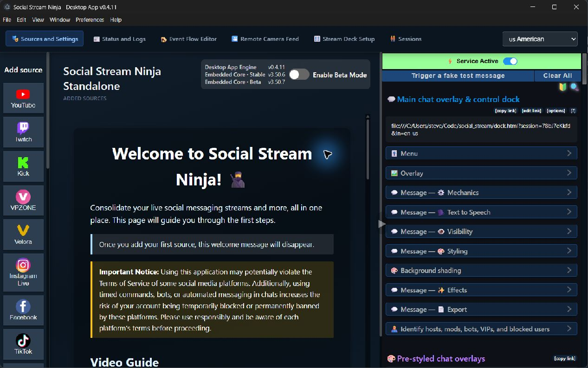

# SSApp Desktop App Guide

SSApp is the native desktop runtime for Social Stream Ninja. It runs the familiar Social Stream interface inside Electron while managing the browser windows, browser sessions, local files, native integrations, and background services needed for reliable capture.

## What belongs to SSApp

The boundary is useful when troubleshooting:

| SSApp desktop runtime | Social Stream core |
| --- | --- |
| Electron windows and browser sessions | Chat normalization and filtering |
| Source window lifecycle and hidden capture | Overlays, docks, and browser pages |
| Native sign-in callback handlers | Session routing and remote commands |
| Direct platform connectors shipped with the app | Platform capture scripts loaded by source windows |
| Local media, TTS, speech recognition, tray, and backups | Event Flow rules, bots, and overlay configuration |
| Local control API and MCP adapter | WebRTC/WebSocket remote-control protocol |

If a source page parses the wrong message, the relevant code is normally in `social_stream`. If a source window will not open, remain active while hidden, preserve its sign-in, or respond to native controls, the relevant code is normally in `ssapp`.

## Main areas

The top navigation provides the app's normal working areas:

- **Sources and Settings** adds sources and controls their connection mode, browser session, activation, visibility, and audio.
- **Status and Logs** shows runtime status and diagnostic information.
- **Event Flow Editor** creates actions triggered by chat and platform events.
- **Remote Camera Feed** opens the camera-oriented workflow supported by the desktop runtime.
- **Stream Deck Setup** configures the companion plugin and source controls.
- **Sessions** manages named Social Stream and browser-session profiles.

The right-side panel is the embedded Social Stream settings interface. It contains links for OBS docks and overlays, chat behavior, Event Flow, bots, TTS, styling, and the wider Social Stream feature set.

In desktop text-entry prompts, press Enter in the text field to submit or Escape from any control to cancel. While composing text with an input method editor (IME), these keys remain available to the composition picker. Prompts with long instructions can be scrolled to reach all controls.

## Sources and connection modes

Each added source is a saved definition. Activating it creates either a real Electron source window or a direct connector, depending on the selected mode and platform.

### Standard mode

Standard mode loads the platform's chat page and injects the appropriate Social Stream capture script. It is the compatibility choice when a direct connector is unavailable or a platform has changed its API.

Because it is a real browser page, Standard mode can use cookies, platform sign-in, navigation, and page-specific rendering. Some platforms require the user to sign in or navigate to an active live chat before capture begins.

### WebSocket and platform connectors

Supported platforms offer direct-connection modes. These avoid depending on a visible chat DOM and can reduce rendering work, but they depend on the platform's current API and authentication requirements.

The exact choices are platform-specific. For example, TikTok can expose WebSocket Auto and polling compatibility modes. Use the labels and help available on the source card instead of assuming that every platform accepts the same mode.

For YouTube sources, stop capture before switching between **YouTube** and **YouTube Shorts** in the source's additional settings. The switch keeps the same video ID and preserves unrelated URL parameters.

### Source state

- **Inactive** means the source definition is saved but no capture window or connector is running.
- **Activating** means the app is opening or connecting it.
- **Active** means SSApp has a live source handle; it does not guarantee the remote channel is currently producing chat.
- **Error** means startup or connection failed and the source needs attention.

Stopping a source closes its active connection. Hiding a source leaves capture running.

The group's mute control applies to its currently running capture pages and saves the choice for later activation. Sources outside that group are unaffected.

If an **Audio update incomplete** warning appears, the preference was saved but one or more running pages could not be updated. Stop and reactivate the affected sources to apply it.

**Stop connecting** also cancels a pending source-page lookup. A delayed result from that attempt is discarded instead of reactivating the source.

Deleting a group removes its child sources and stops their capture connections. **Clear All Sources** removes every source and group. Bulk deletion saves the resulting configuration once, so it does not rewrite the entire settings list for each removed source.

## Browser sessions and sign-in

Named browser sessions let the same SSApp installation keep separate cookies and storage for different accounts. A source card shows the session it uses, and its settings menu can move it to another session while inactive.

Every source's session dialog includes a platform-default option, including custom website sources. Select it and save to return from a named session to the default browser session.

Groups retain their selected browser session and custom settings across restarts, even when they currently contain no discovered streams.

Removing a custom browser session resets referencing sources and groups to their platform defaults and clears remembered assignments to that session. The change applies on their next activation; already-running capture pages keep their current session until stopped.

Opening sign-in from a group uses that group's browser session and custom user agent. A user agent identifies the browser to the website; **AUTO** uses the platform's default configuration.

If a source's user agent or associated browser-identification fields differ from the local presets, **Current source setting** preserves the full configuration when you open and save User Agent Settings. Selecting a named preset applies that preset's fields. Select **AUTO** explicitly to remove the override and its associated header settings.

Previously saved Chrome 142–144 Windows/Mac presets may contain an extra space in the version number. Reselect the named preset and save to use the corrected value on the next activation or sign-in.

Removing a custom user-agent entry deletes only that named preset, even if another preset has the same value. Removing the currently selected entry selects **AUTO** in the dialog; save to apply that change to the source.

Use separate sessions when:

- two channels require different accounts on the same platform;
- a bot account should not share the broadcaster's cookies;
- a source needs a clean sign-in without disturbing other sources;
- testing needs to be isolated from a normal production profile.

Deleting a session removes the app's saved session definition and queues its Electron partition for safe cleanup. Do not treat a session name as a platform username; it is an SSApp browser-storage boundary.

Supported OAuth-style sign-ins open temporary loopback callback servers. These exist only during the sign-in flow and are separate from the permanent local control and media services.

## Hidden capture and window controls

SSApp is designed to keep capturing after source windows are moved off screen or hidden. The app disables normal background timer throttling and includes additional keepalive handling for windows that would otherwise stop receiving frames.

Useful controls include:

- hide or show an individual source window;
- mute a source without stopping it;
- pin a window always on top;
- make a window click-through;
- resize a source to common capture resolutions;
- inject custom CSS into a selected window;
- choose audio input or output devices;
- reload, navigate, inspect, or close a source window.

The **Window** menu also provides global click-through and tray behavior. **Close to Tray** keeps SSApp running when the main window is closed. On Linux desktops without a tray host, SSApp avoids leaving the application impossible to restore.

## Local media and Event Flow

Event Flow can use local audio, image, and video files selected through SSApp. The desktop app records only files that the user explicitly approves and serves them from a loopback HTTP service.

The local media server:

- listens on `127.0.0.1:3001` by default;
- starts automatically when the Social Stream runtime is available;
- uses a random token in every public path;
- serves only registered media files and approved runtime assets;
- supports HTTP byte ranges for audio and video playback;
- rejects path traversal and arbitrary custom JavaScript in Local Flow Actions.

If port `3001` is already in use, Event Flow's local media features remain unavailable until the conflict is removed or the port is changed through the app interface that requested local media.

## Local voice features

SSApp adds native local voice workers:

- **Kokoro Text-to-Speech** runs in a worker and loads the bundled ONNX model when selected.
- **Local speech recognition** supports the co-host workflow using a locally cached Whisper-compatible model.
- **System TTS voices** are exposed where the operating system and Electron support them.

Workers are reused between requests so models do not reload for every message. Model loading can temporarily increase memory use, especially on the first request.

## Stream Deck and remote control

Choose **File > Set Up Stream Deck** or the top navigation item to open the setup workflow. Stream Deck commands use Social Stream's existing remote command path and can start, stop, reload, mute, or hide supported sources.

Remote control through a Social Stream session is different from the localhost AI API:

- Social Stream remote control uses its WebRTC or WebSocket transport and can cross machines.
- The AI control API binds only to `127.0.0.1` and is intended for software on the SSApp computer.

See [Automation, MCP, and Local APIs](AUTOMATION.md) for the complete distinction.

## Local WebSocket relay

The optional local relay connects Social Stream pages on the SSApp machine without using the normal remote transport.

Use **File > Enable Local Server** to start it. New installations default to `127.0.0.1:3003`. Installations that previously used port `3000` keep that port so existing OBS and overlay links do not silently break.

The menu also lets you change the port. When enabled, SSApp adds the matching `localserverport` value to generated Social Stream links.

**Allow Local Server Connections from the LAN** changes the bind address to `0.0.0.0`. LAN mode has no authentication or encryption. Enable it only on a trusted network. For cross-machine control over the internet, prefer Social Stream's normal WebRTC transport.

## Saved message history

Open **Message Browser** from the Social Stream settings panel to search saved chat and download JSON, TSV, or HTML exports. Search accepts names, numeric or text user IDs, message text, and source types.

Date filters and custom export dates use your computer's local calendar days, including the full ending day. **Last 24 Hours** exports the preceding 24 hours exactly. Export time ranges replace the on-screen date range; other active filters still apply.

The desktop Message Browser shows a snapshot taken when it opens. Close and reopen it to include newly saved messages. **Delete All History** clears the saved database, including messages outside the current filters.

The browser displays up to 500 messages at once. Scroll down for older messages and back up for newer ones; removing a row from the display does not delete its saved message. Keyboard users can Tab to the **Saved messages** region and use Page Up, Page Down, Home, or End to scroll.

## Backup and transfer

SSApp offers two intentionally different backup systems.

### Settings Backup

**File > Settings Backup** exports or imports normal SSApp and Social Stream configuration. It is the smaller, safer choice when only settings need to move.

Invalid source-list data is rejected before import. Before applying a valid import, SSApp
saves the previous settings as `settings-before-import.data` in the current profile folder.
The completion dialog shows its path; import that file to undo the most recent import.

### Advanced Full Session Transfer

**File > Advanced Full Session Transfer** creates an encrypted archive of the complete application profile. It can include:

- settings and saved sources;
- Electron browser sessions and sign-ins;
- downloaded local models;
- optional Chromium caches.

Automatic transfer backups store their encryption password through the operating system's secure credential storage. They wait for active sources to stop before running so browser state can be flushed consistently.

Restoring a full-session archive closes SSApp, replaces the local profile, and restarts the application. The restore runner keeps a `pre-restore-*` copy of the previous data beside the user-data directory. Treat the archive and its password as sensitive: it can contain signed-in browser state.

## Application data and portable mode

Default profile locations are:

- Windows: `%APPDATA%\SocialStream\`
- macOS: `~/Library/Application Support/SocialStream/`
- Linux: `~/.config/SocialStream/`

Set `SSAPP_USER_DATA_DIR` before launch to choose an explicit profile directory. This is useful for server deployments, testing, multiple independent installations, and recoverable migrations. SSApp sets Electron's application paths early in startup, so Chromium's `--user-data-dir` is not a replacement.

The Windows portable executable keeps the expected portable behavior described in the app's migration code. Linux-specific profile, AppImage, and notification details are in [Linux Notes](LINUX_NOTES.md).

## Startup and stability controls

The **Preferences > Startup Flags** window exposes settings that must be applied before Chromium starts, including:

- locale override;
- preference for bundled Social Stream assets;
- forced TikTok classic mode;
- multiple-instance operation;
- platform compatibility options.

SSApp also tracks unclean startup failures. Repeated early crashes can automatically increase the GPU fallback level; stable sessions later ease that fallback. This is why a launch may report that stability mode was enabled even when the user did not manually change hardware acceleration.

If a source's capture page crashes, its status changes to an error. Use that source's
**Reload** button to reconnect; a successful Standard-mode page reload clears the crash error.

Use **Help > Command Line Arguments** to view the launch options supported by the running version.

## Loading development or custom sources

The File menu can load Social Stream from:

- a local folder;
- a ZIP archive;
- a user-selected `custom.js` file.

These features are intended for development, integration testing, and deliberate customization. SSApp validates local source paths and remembers the active override until it is cleared.

In this repository, `resources/social_stream_fallback` is generated packaging output, not the source of truth. Make normal Social Stream changes in the separate `social_stream` checkout.

## Headless servers

`--ssapp-headless-control` starts SSApp with its windows hidden. Chromium source windows still exist, and Linux still needs X11/Xvfb or another working Electron display backend.

Headless mode does not enable an HTTP control service. Add `--ssapp-control-api` or `SSAPP_CONTROL_API=1` only when a same-machine automation process needs it.

Read [Cloud and Headless Hosting](CLOUD_HOSTING.md) for AppImage, Xvfb, systemd, VNC, and long-running capture instructions.

## Troubleshooting

### A source is active but no messages arrive

1. Confirm the channel is live and its public chat is actually moving.
2. Show the source window and check for a sign-in wall, consent page, CAPTCHA, or ended stream.
3. Try the other connection mode offered on the source card.
4. Reload the source after changing modes.
5. Check **Status and Logs** for connector or page-load errors.

An active source with a quiet remote chat is not itself a capture failure.

### Hidden capture stops

Show the source and confirm the remote page is still receiving messages. If the page is active but SSApp output is not, record the platform, mode, approximate time, and whether reloading the source resumes capture. Developers can use the real Electron hidden-capture diagnostics described in [Cloud and Headless Hosting](CLOUD_HOSTING.md).

### A local server will not start

Check whether another program owns the port. The common defaults are `3001` for local media, `3003` for the local WebSocket relay, and `17777` for the opt-in control API. Existing installations may intentionally keep relay port `3000`.

### Settings or sign-ins need to move

Use Settings Backup for configuration only. Use encrypted Full Session Transfer when browser sessions, sign-ins, or downloaded models must move too.

### Reporting a problem

**Help > Report current issue to developer** creates a manual report. Automatic bug reporting is separate and opt-in. The menu explains what will be sent before it is enabled.
